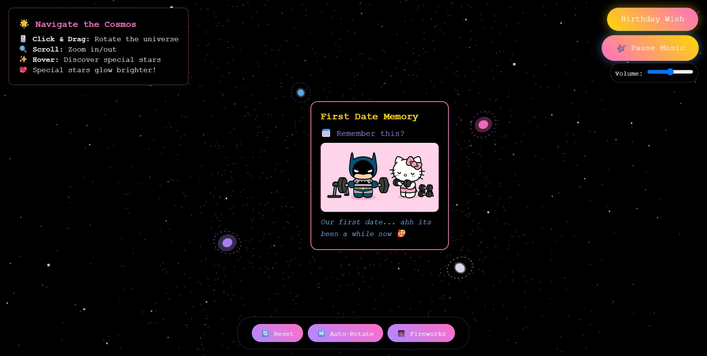

# 🌌 Project: Cosmic Love ✨

### 💡 Project Idea:
**_Cosmic Love_** lets you store your favorite memories as glowing stars in a 3D galaxy.  
It’s a heartfelt gifting idea for someone special — where each star holds a shared memory.

### ✨ Purpose:
Created as a personal project and open-sourced for everyone who wants to learn.  
Use it, modify it, and surprise your favorite person ✨

### 🛠️ About the Code  

**Languages Used:**

  
  
  

The entire codebase is kept inside a **single HTML file** for simplicity.  
You can easily edit text, names, photos, and music inside it.

### 🔧 Customization Guide 
- **Default Password:** `123456`
- **Change images:** Replace or rename your image files in the project folder.  
- **Change music:** Replace the song inside `/media` and rename it to `birthday-song.mp3`.  
- **Change names or texts:** Edit directly inside the main HTML file.

---

**Made with ❤️ by edwyyy** – *If you like it, give it a star on GitHub!* ⭐

  
  

 this project is built with [three.js] (https://threejs.org), parts of this project were done using AI- assisted tools. Rest of the customization, css styling, html layout and added features are done by original author @edwyyy/edwindavis
